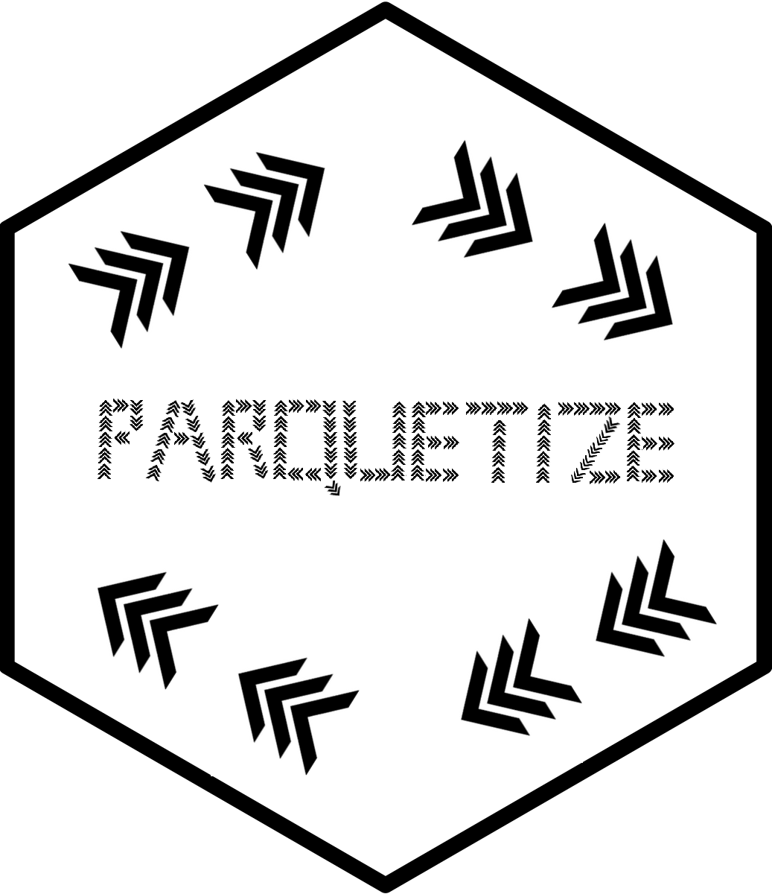

<!-- badges: start -->

[](https://github.com/ddotta/fmtsas/actions/workflows/check-release.yaml)
[](https://codecov.io/gh/ddotta/parquetize)
<!-- badges: end -->

:package: Package `parquetize` 
======================================

R package that allows to convert databases of different formats to [parquet](https://parquet.apache.org/) format.

## Installation

``` r
# install.packages("remotes")
remotes::install_github("ddotta/parquetize")
```
