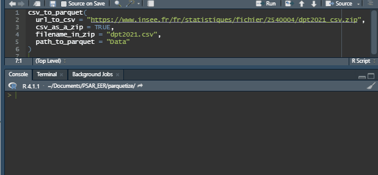

<!-- badges: start -->

[](https://CRAN.R-project.org/package=parquetize)
[](https://CRAN.R-project.org/package=parquetize)
[](https://github.com/ddotta/parquetize/actions/workflows/check-release.yaml)
[](https://app.codecov.io/gh/ddotta/parquetize)
[](https://www.codefactor.io/repository/github/ddotta/parquetize)
<!-- badges: end -->

:package: Package `parquetize` 
======================================

R package that allows to convert databases of different formats (csv, SAS, SPSS, Stata, rds, duckdb, sqlite, JSON, ndJSON) to [parquet](https://parquet.apache.org/) format in a same function.

## Installation

To install `parquetize` from CRAN :  

``` r
install.packages("parquetize")
```

Or alternatively to install the development version from GitHub :  

``` r
remotes::install_github("ddotta/parquetize")
```

Then to load it :  

``` r
library(parquetize)
```

## Why this package ?

This package is a simple wrapper of some very useful functions from the [haven](https://github.com/tidyverse/haven), [readr](https://github.com/tidyverse/readr/), [jsonlite](https://github.com/jeroen/jsonlite), [RSQLite](https://github.com/r-dbi/RSQLite), [duckdb](https://github.com/cran/duckdb) and [arrow](https://github.com/apache/arrow) packages.

While working, I realized that I was often repeating the same operation when working with parquet files : 

- I import the file in R with {haven}, {jsonlite}, {readr}, {DBI}, {RSQLite} or {duckdb}.
- And I export the file in parquet format

As a fervent of the DRY principle (don't repeat yourself) the exported functions of this package make my life easier and **execute these operations within the same function**.  

**The last benefit** of using package `{parquetize}` is that its functions allow to create single parquet files or partitioned files depending on the arguments chosen in the functions.

- [csv_to_parquet()](https://ddotta.github.io/parquetize/reference/csv_to_parquet.html)
    - **The other benefit of this function** is that it allows you to convert csv files whether they are stored locally or available on the internet directly to csv format or inside a zip.
- [json_to_parquet()](https://ddotta.github.io/parquetize/reference/json_to_parquet.html)
    - **The other benefit of this function** is that it handles JSON and ndJSON files in a same function. There is only one function to use for these 2 cases.  
- [rds_to_parquet()](https://ddotta.github.io/parquetize/reference/rds_to_parquet.html)  
- [table_to_parquet()](https://ddotta.github.io/parquetize/reference/table_to_parquet.html)
    - **The other benefit of this function** is that it handles SAS, SPSS and Stata files in a same function. There is only one function to use for these 3 cases. To avoid overcharging R's RAM for huge table, the conversion can be done by chunk. For more information, see [here](https://ddotta.github.io/parquetize/articles/aa-conversions.html)
- [sqlite_to_parquet()](https://ddotta.github.io/parquetize/reference/sqlite_to_parquet.html)
- [duckdb_to_parquet()](https://ddotta.github.io/parquetize/reference/duckdb_to_parquet.html)

    
For more details, see the documentation and examples :  
- [table_to_parquet()](https://ddotta.github.io/parquetize/reference/table_to_parquet.html#ref-examples).  
- [csv_to_parquet()](https://ddotta.github.io/parquetize/reference/csv_to_parquet.html#ref-examples).  
- [json_to_parquet()](https://ddotta.github.io/parquetize/reference/json_to_parquet.html#ref-examples).  
- [rds_to_parquet()](https://ddotta.github.io/parquetize/reference/rds_to_parquet.html#ref-examples).  
- [sqlite_to_parquet()](https://ddotta.github.io/parquetize/reference/sqlite_to_parquet.html#ref-examples)  
- [duckdb_to_parquet()](https://ddotta.github.io/parquetize/reference/duckdb_to_parquet.html#ref-examples).

## Example

You want to use the Insee file of first names by birth department? Use R and {parquetize} package that takes care of everything: it downloads the data (3.7 million rows) and converts it to parquet format in few seconds ! 



## Contribution

Feel welcome to contribute to add features that you find useful in your daily work. Ideas are welcomed in [the issues](https://github.com/ddotta/parquetize/issues).
